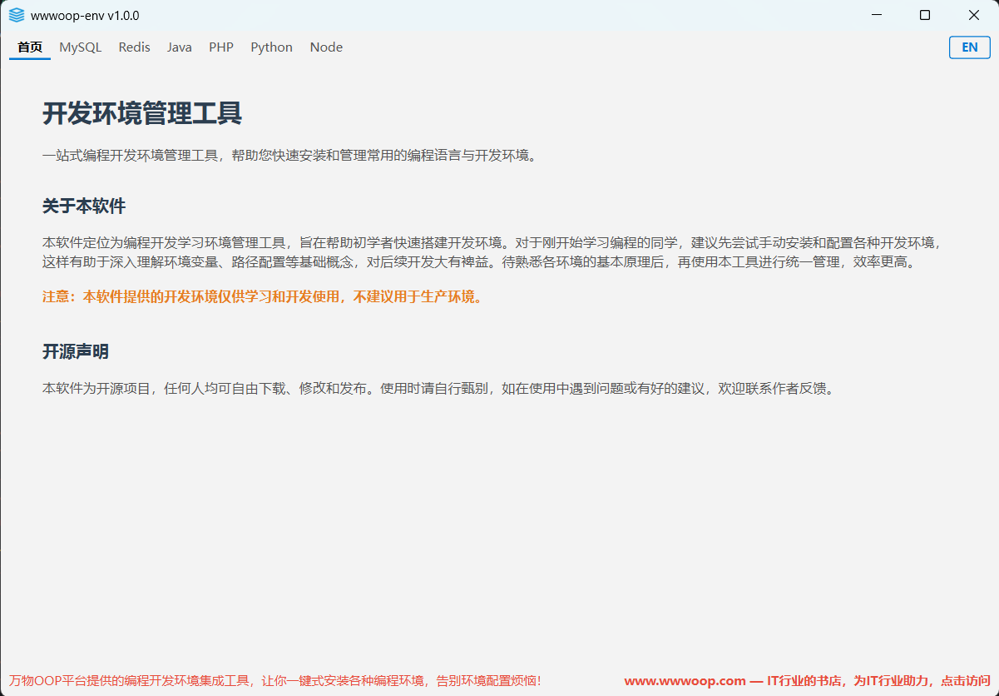
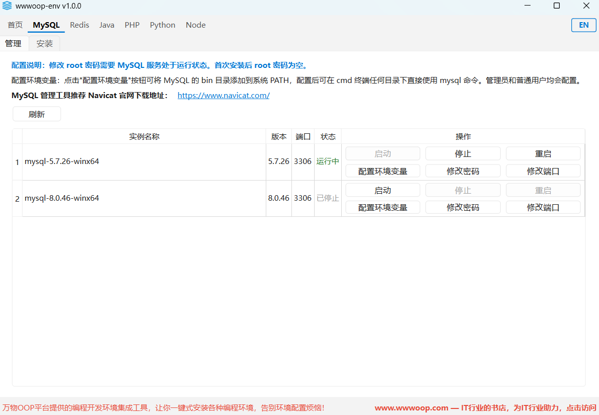
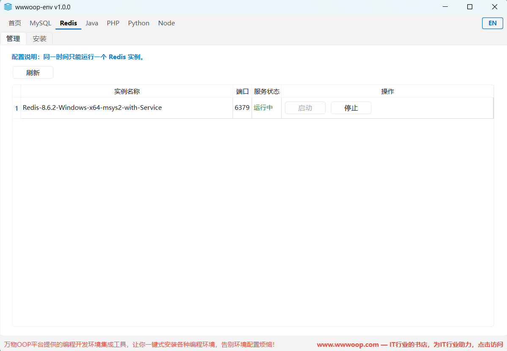
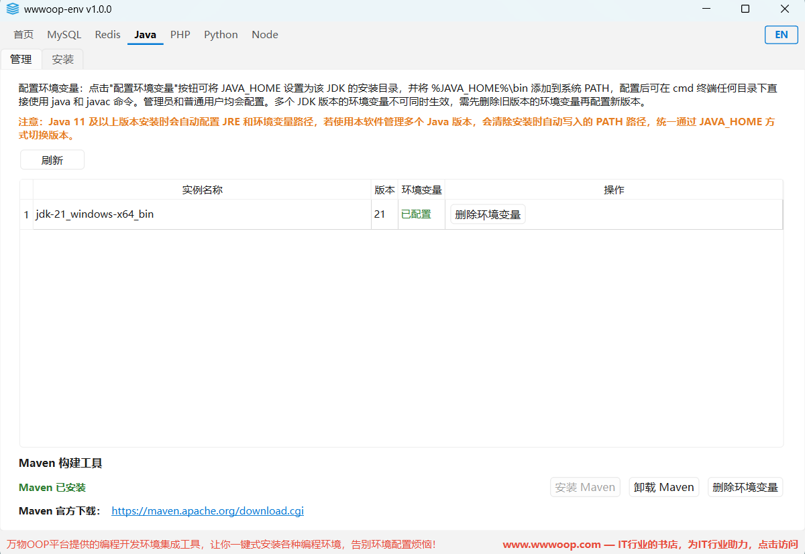
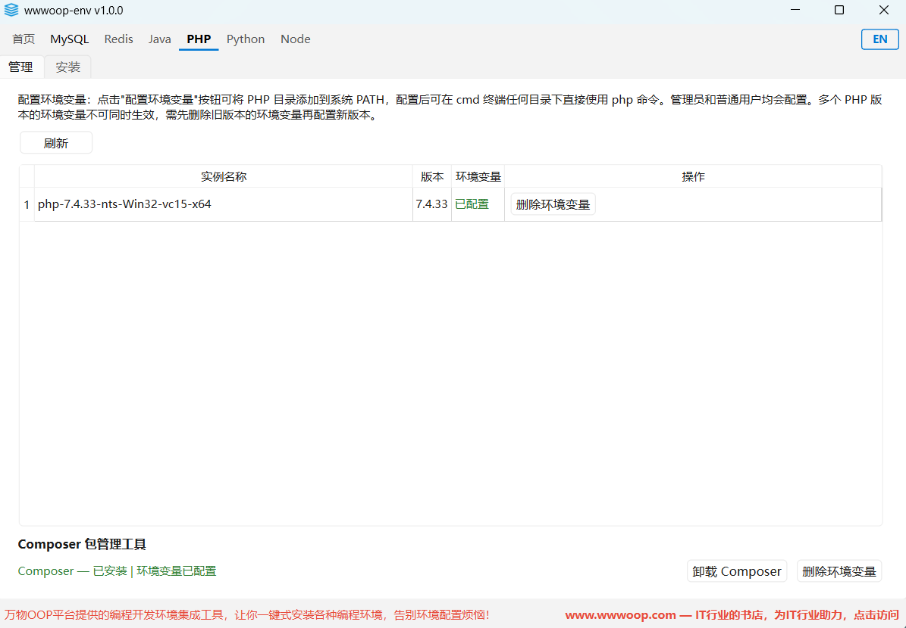
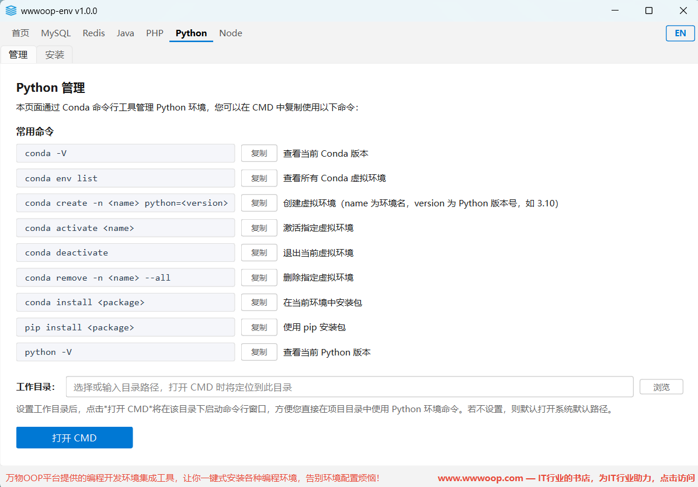
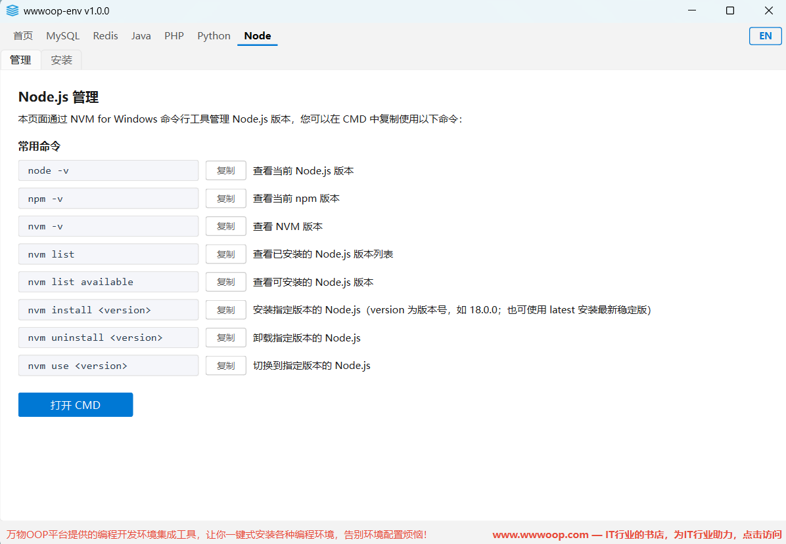

# 编程开发环境搭建工具

> 一键式编程环境集成工具，让你告别繁琐的环境配置，专注编码本身！


## 项目简介

**编程开发环境搭建工具** 是由万物OOP平台提供的 Windows 10/11 编程开发环境集成工具。通过本工具，你可以一键安装各种开发所需的环境和工具，不再为环境配置而苦恼。

## 项目目录结构

```
wwwoop-env/
├── main.py                          # 程序启动入口（自动申请管理员权限）
├── requirements.txt                 # 依赖清单
├── build.py                         # PyInstaller 打包脚本
├── assets/                          # 资源文件
│   └── icons/                       # 图标资源
│       └── app.ico                  # 应用图标
├── installation-package/            # 内置环境安装包
│   ├── java/                        # Java 环境
│   │   ├── jdk/                     # JDK 安装包
│   │   └── maven/                   # Maven 安装包及配置模板
│   │       ├── apache-maven-3.9.15-bin.zip
│   │       └── settings.xml.example
│   ├── mysql/                       # MySQL 环境
│   │   ├── mysql-5.7.26-winx64.zip
│   │   ├── mysql-8.0.46-winx64.zip
│   │   └── my.ini.example           # MySQL 配置模板
│   ├── php/                         # PHP 环境
│   │   ├── datas/                   # PHP 安装包
│   │   │   ├── php-7.4.33-nts-Win32-vc15-x64.zip
│   │   │   └── php-8.5.5-nts-Win32-vs17-x64.zip
│   │   └── expand/                  # PHP 扩展工具
│   │       └── composer.zip
│   └── redis/                       # Redis 环境
│       └── Redis-8.6.2-Windows-x64-msys2-with-Service.zip
├── logs/                            # 运行日志（自动生成）
└── src/                             # 源代码
    ├── app.py                       # QApplication 初始化与启动
    ├── core/
    │   ├── config.py                # 全局常量、配色、路径配置
    │   └── i18n.py                  # 国际化（中英文切换）
    ├── services/                    # 业务逻辑层
    │   ├── mysql_service.py         # MySQL 安装/卸载/启停/配置
    │   ├── redis_service.py         # Redis 安装/卸载/启停/配置
    │   ├── java_service.py          # Java/Maven 安装与配置
    │   └── php_service.py           # PHP/Composer 安装与配置
    ├── ui/
    │   ├── main_window.py           # 主窗口（顶部导航栏 + 页面栈）
    │   ├── pages/                   # 各功能页面
    │   │   ├── home_page.py         # 首页
    │   │   ├── mysql_page.py        # MySQL 管理页
    │   │   ├── redis_page.py        # Redis 管理页
    │   │   ├── java_page.py         # Java 管理页
    │   │   ├── php_page.py          # PHP 管理页
    │   │   ├── python_page.py       # Python 管理页
    │   │   └── node_page.py         # Node 管理页
    │   └── components/              # 通用 UI 组件
    │       ├── topbar.py            # 顶部导航栏组件
    │       └── footer.py            # 底部状态栏组件
    └── utils/
        └── logger.py                # 日志工具
```

## 内置环境安装包

`installation-package/` 目录存放了各环境的内置安装包，软件运行时会从此目录读取安装包进行环境安装。目前包含：

| 环境 | 安装包 | 说明 |
|------|--------|------|
| MySQL | mysql-5.7.26-winx64.zip | MySQL 5.7 免安装版 |
| MySQL | mysql-8.0.46-winx64.zip | MySQL 8.0 免安装版 |
| Redis | Redis-8.6.2-Windows-x64-msys2-with-Service.zip | Redis 8.6.2 含服务安装 |
| Java | jdk/ | JDK 安装包（需自行放入） |
| Maven | apache-maven-3.9.15-bin.zip | Maven 3.9.15 |
| PHP | php-7.4.33-nts-Win32-vc15-x64.zip | PHP 7.4 NTS x64 |
| PHP | php-8.5.5-nts-Win32-vs17-x64.zip | PHP 8.5 NTS x64 |
| Composer | composer.zip | PHP 包管理工具 |

> **注意**：由于安装包文件过大，`installation-package/` 目录不会上传到仓库。获取方式如下：
> - **GitHub**：在 Releases 里下载，包含完整的内置环境安装包
> - **Gitee 码云**：因 Releases 文件大小有限制，无法提供 `installation-package/` 目录,目前只有编译后的 exe 可执行文件。
> - **万物OOP平台**：可通过 [https://wwwoop.com/home/Index/projectInfo?goodsId=155&typeParam=3&subKey=2](https://wwwoop.com/home/Index/projectInfo?goodsId=155&typeParam=3&subKey=2) 获取编译后的 exe 及内置环境安装包

> **注意**：若自带安装包不满足需求，可自行下载对应版本的免安装版（ZIP 格式），放入 `installation-package/` 对应子目录即可。

## 环境要求

- **操作系统**：Windows 10 / 11
- **Python**：3.12（conda 环境：`oop-env`）
- **包管理**：conda / pip

## 安装依赖

### 1. 创建并激活 conda 环境

```bash
conda create -n oop-env python=3.12
conda activate oop-env
```

### 2. 安装项目依赖

```bash
pip install -r requirements.txt
```

依赖清单（`requirements.txt`）：

| 包名 | 用途 |
|------|------|
| PyQt6>=6.6.0 | GUI 框架 |
| PyInstaller>=6.3.0 | 打包为 exe 可执行文件 |

## 运行项目

```bash
conda activate oop-env
python main.py
```

启动后即可看到主窗口，顶部为导航栏，下方为页面内容区。

## 打包为 exe

### 一键打包

```bash
python build.py
```

打包完成后，可执行文件输出在 `dist/wwwoop-env/` 目录下。

> **重要**：打包完成后，还需将项目根目录下的 `installation-package/` 文件夹手动复制到 `dist/wwwoop-env/` 目录中，否则软件运行时将无法找到内置的环境安装包，环境安装功能将不可用。
>
> 复制后的目录结构应为：
> ```
> dist/wwwoop-env/
> ├── wwwoop-env.exe
> ├── assets/
> ├── installation-package/    ← 手动复制到此
> │   ├── java/
> │   ├── mysql/
> │   ├── php/
> │   └── redis/
> └── ...
> ```

### 手动打包

```bash
pyinstaller --noconfirm --onedir --windowed --name "wwwoop-env" --add-data "assets;assets" main.py
```

如需自定义图标，将 `.ico` 图标文件放入 `assets/icons/` 目录并命名为 `app.ico`，打包脚本会自动识别。

## 软件截图

### 首页



### MySQL



### Redis



### Java



### PHP



### Python



### Node



## 免责声明

本软件为开源项目，任何人均可自由下载、修改和发布。使用时请自行甄别，如在使用中遇到问题或有好的建议，欢迎联系作者反馈。

本软件提供的开发环境仅供学习和开发使用，不建议用于生产环境。使用本软件所造成的一切后果，由使用者自行承担，作者不承担任何责任。

## 技术栈

- **GUI 框架**：PyQt6
- **语言**：Python 3.12
- **打包工具**：PyInstaller
- **日志**：Python 标准库 logging

## 链接

- 官网：[www.wwwoop.com](https://www.wwwoop.com)
- Gitee 开源地址：[https://gitee.com/helloll/wwwoop-env](https://gitee.com/helloll/wwwoop-env)
- GitHub 开源地址：[https://github.com/Json870422471/wwwoop-env](https://github.com/Json870422471/wwwoop-env)
